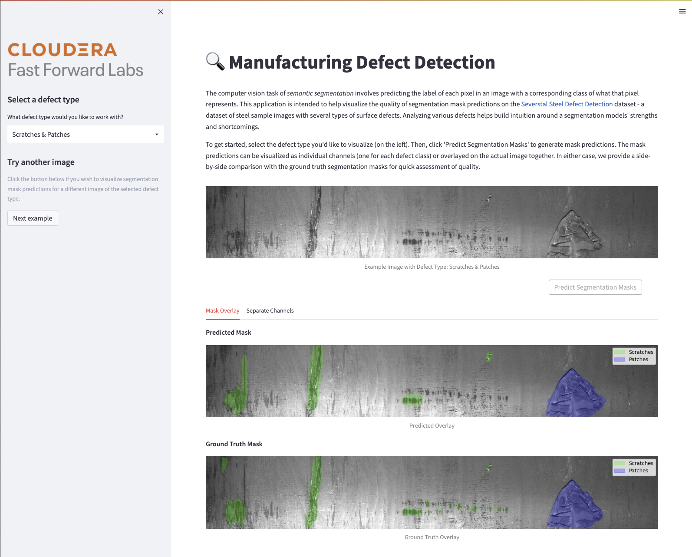

# Detecting Defects with Semantic Segmentation

A demonstration of how the computer vision task of semantic segmentation can be used to detect defects in manufacturing images.



The goal of this application is to demonstrate how to use TensorFlow's `tf.data` API can be used in combination with Keras to train a semantic segmentation model on a defect detection use case. In addition, we also experiment with several methods for dealing class imbalance, a common issue for many real-world modeling use cases. These ideas are explored through the [Severstal Steel Defect Detection](https://www.kaggle.com/competitions/severstal-steel-defect-detection/overview) dataset - a dataset comprised of images of steel surface defects taken from high frequency cameras used to assess manufacturing quality.

## Project Structure

```
.
├── logs                                   # log files from experimental training runs used by tensorboard
├── images                                 # static images and assets
├── requirements.txt
├── setup.py
├── LICENSE
├── README.md
├── .project-metadata.yaml                 # declarative specification for AMP logic
├── sample_data.tar.gz                     # small sample of dataset used for visualization
├── apps
│   ├── app.py                             # Streamlit application to visualize predictions
│   ├── app_utils.py                       # Utility functions for application
│   └── tmp                                # Working directory for tmp files
├── scripts
│   ├── install_dependencies.py            # commands to install python package dependencies
│   ├── prepare_data.py                    # prepares data and model assets for use by AMP
│   ├── create_train_experiments.py        # uses CML APIv2 to create training jobs
│   ├── run_train.py                       # CLI enabled script to launch training jobs
│   ├── launch_tensorboard.py              # script to launch tensorboard application
│   └── launch_app.py                      # script to launch streamlit application
├── notebooks
│   ├── Severstal_EDA.ipynb                # exploratory data analysis
│   ├── Data_Pipeline_Walkthrough.ipynb    # example of how to use AMP's data and pipeline classes
│   └── Model_Evaluation.ipynb             # example of utility functions for evaluating model performance
└── src
    ├── data_pipeline.py                   # module with custom SegmentationDataPipeline class
    ├── model.py                           # unet model implementation
    ├── train.py                           # training script used by training experiments
    ├── data_utils.py                      # utility functions for data needs
    └── model_utils.py                     # utility functions for modeling needs

```

By launching this AMP on CML, the following steps will be taken to recreate the project in your workspace:

1. A Python session is run to install project dependencies.
2. A Python session is run to prepare data and model assets for use by the AMP. This includes downloading data (if user's Kaggle credentials are provided), preprocessing segmentation masks and saving locally, and preparing a model for use by the Streamlit applications.
3. A Python session uses [CML APIv2](https://docs.cloudera.com/machine-learning/cloud/api/topics/ml-api-v2.html) to create a series of dependent training jobs which in combination form a set of experiments to search over. The experiments are comprised of various strategies for dealing with class imbalanced data including: undersampling, oversampling, [balanced class weighting](https://scikit-learn.org/stable/modules/generated/sklearn.utils.class_weight.compute_class_weight.html), and [effective number of samples (ENS)](https://arxiv.org/pdf/1901.05555.pdf) weighting, along with a baseline. Note that these training jobs are just created and not run automatically. Running each training experiment requires access to a GPU session, is extrememly compute intensive, and takes ~12 hours to complete. For this reason, we have packaged the training logs for these experiments in the project under the `logs/` directory.
4. An application is deployed that hosts a [TensorBoard](https://www.tensorflow.org/tensorboard) dashboard to visualize the packaged training experiment logs.
5. An Streamlit application is deployed to help visualize segmentation model predictions.

> **Note** - During project creation, user is prompted to optionally provide kaggle username and API token information. If provided, these values are stored as environment variables within the project and used to download the full [Severstal Steel Defect Detection](https://www.kaggle.com/competitions/severstal-steel-defect-detection/overview) dataset; allowing the user to execute all notebooks and training scripts. If not provided, a small sample of the data (sample_data.tar.gz) will be used to support the Streamlit application. In this case, none of the notebooks or training scripts can be run as the require access to the full dataset.

## Launching the Project on CML

This AMP was developed against Python 3.9. There are two ways to launch the project on CML:

1. **From Prototype Catalog** - Navigate to the AMPs tab on a CML workspace, select the "Detecting Defects with Semantic Segmentation" tile, click "Launch as Project", click "Configure Project"
2. **As an AMP** - In a CML workspace, click "New Project", add a Project Name, select "AMPs" as the Initial Setup option, copy in this repo URL, click "Create Project", click "Configure Project"
